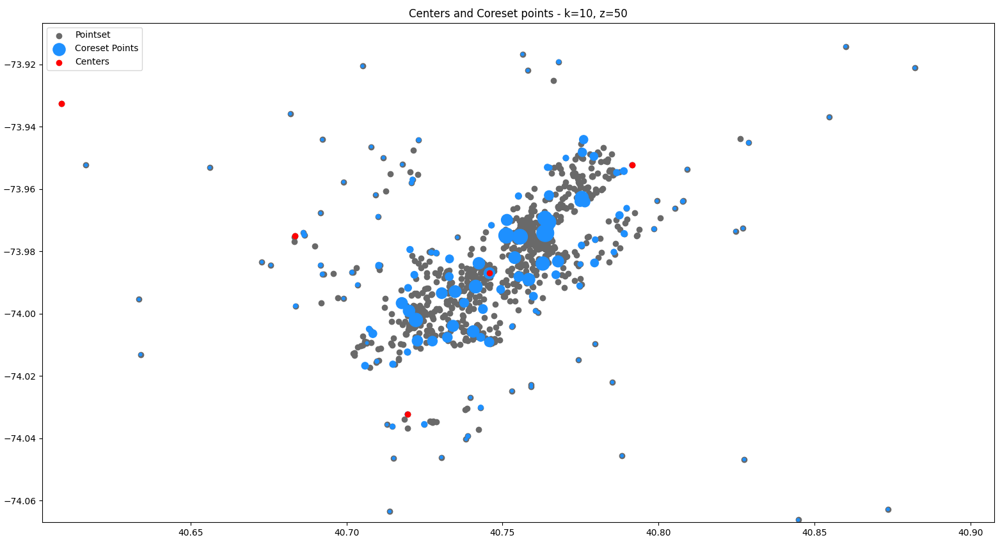

# Big Data Computing

## Homeworks:

This repository contains all the assignments of the __Big Data Computing__ course.  
The purpose of those homeworks is to get acquainted with __Spark__ and with its use to implement __MapReduce__ algorithms.  
The last 2 homeworks are focused on the __k-center with z outliers problem__, a robust version of the k-center problem which is useful in the analysis of noisy data.

- [Homework 1:](https://github.com/federicochiarello/BigDataComputing/tree/main/HW1)  
  In the first homework I developed a Spark program to analyze a dataset of an online retailer which contains several __transactions__ made by customers, where a transaction represents several products purchased by a customer.

- [Homework 2:](https://github.com/federicochiarello/BigDataComputing/tree/main/HW2)  
  In the second homework I implemented the __3-approximation sequential algorithm__ for the k-center with z outliers problem. This algorithm proposed by Charikar et al. is simple to implement but has superlinear complexity.

- [Homework 3:](https://github.com/federicochiarello/BigDataComputing/tree/main/HW3)  
  In the third homework I implemented a __2-round MapReduce coreset-based algorithm__ for the k-center with z outliers problem, where the use of the inefficient 3-approximation is confined to a small coreset computed in parallel through the efficient __Farthest-First Traversal__.  
  This efficient implementation was run on a big dataset (about 1.2M points in 7 dimensions) on the [CloudVeneto](http://cloudveneto.it/) cluster.  

## Plots:

I have also developed some programs that generate plots of the results of the different clustering algorithms.  
Here I leave two examples of the results obtained on an Uber dataset.

 

 

